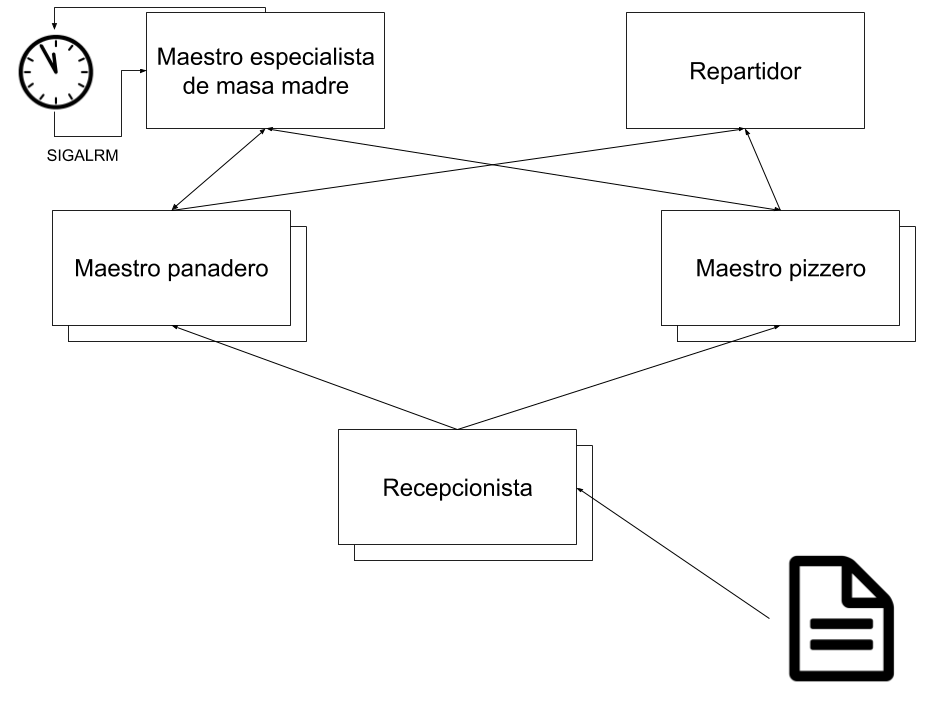
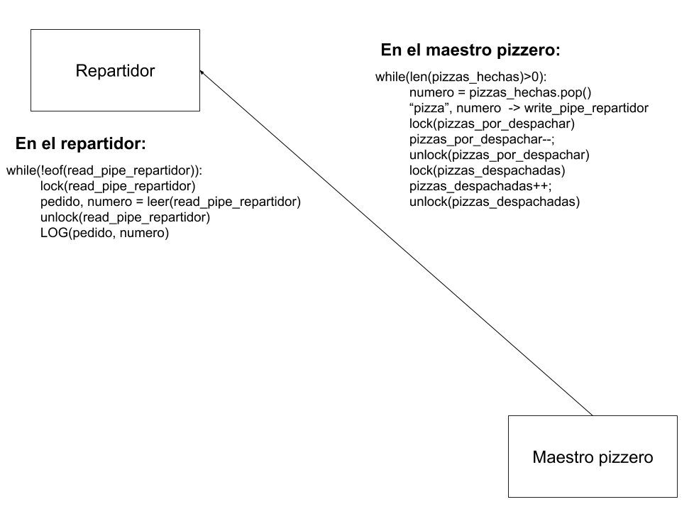

# Informe TP1 concurrentes
#### _Alumno: Gianmarco Cafferata_
#### _Padron: 99423_

## Análisis del problema

Recepcionistas: Los recepcionistas necesitan recibir pedidos de una única fuente y enviarlos a los maestros panaderos/pizzeros.

Maestros panaderos/pizzeros: Deben poder recibir los pedidos de los recepcionistas, solicitar masa madre y entregar las pizzas al repartidor.

Repartidor: Recibe o bien pizzas o panes y los despacha a sus domicilios de pedido.

Especialista masa madre: Debe alimentar continuamente en intervalos periódicos todas las masas madres y esperar a que las masas madre fueran alimentadas la cantidad de veces necesarias para estar listas. Debe recibir pedidos de los maestros pizzeros/panaderos y solo entregarles masa madre si hay alguna lista.

## Casos de uso

## Resolución del problema

Se dividio al problema en los siguientes procesos:

Ademas de un proceso "gerente" responsable de instanciarlos y esperarlos a todos.

Todas las flechas indican uso de pipes, exceptuando la que va del archivo al recepcionista que indica lectura de un archivo.

Para todas las lecturas, ya sea de pipes o del archivo de pedidos se da un problema de condición de carrera que se soluciono con la implementacion de locks.

Para la escritura del log tambien nos encontramos con una condición de carrera por lo que utilizamos lock para escribir. Todos escriben al mismo archivo de log.

Para asignar los números de pedidos todos los recepcionistas deben conocer cuantos pedidos hay y, para coordinarse con los maestros, en que estado estan. Esto se realiza por medio de una memoria compartida que leen y escriben tanto maestros como recepcionistas.

El especialista de masa madre esta compuesto por dos procesos, uno que envia una señal cada vez que hay que alimentar la masa madre y otro que atiende los pedidos de masa madre. De esta forma, simulando señales temporizadas, evitamos que el especialista se quede bloqueado en lectura/escritura cuando tiene que alimentar continuamente la masa.

## Comunicación entre procesos

A continuación se muestra un diagrama de cada esquema de comunicacion. Como la comunicación de los maestros pizzeros/panaderos es analoga, solo se mostrara uno de los dos.

### Lectura del archivo de pedidos

### Comunicacion recepcionista -> maestro panadero/pizzero

### Comunicación maestro pizzero/panadero -> repartidor

### Comunicación maestro pizzero/panadero -> especialista

### Comunicación especialista -> maestro pizzero/panadero

## Transición de estados de pedidos

A continuación se esquematiza la transición de un pedido de pizza

## Otras utilidades

En el desarrollo de la solución se crearon varias utilidades para simplificar el código.

### resource_manager

El resource manager es el encargado de alocar recursos, interactuar con archivos y crear procesos de forma "segura".
Esto implica que se conserva un registro dinamico de todos los recursos solicitados para liberarlos todos
juntos cuando asi se solicite (ej: finalizacion del proceso). Esto facilita el uso de recursos compartidos y la concurrencia.

Todo recurso o archivo solicitado por esta API debe ser o bien liberado con sus propia API o esperar a liberarlo con free_all_resources al finalizar el proceso.

El resource manager tambien garantiza que todos los procesos respondan de forma agradable al SIGINT, liberando todos su recursos.

### debug_utils

Administra los logs proviendo una api que permite strings con formato (del estilo printf, fprintf, sprintf, etc...).
Tiene 4 niveles de log:
* Debug
* Info
* Error
* Fatal

Todos imprimen a un debug file previamente seteado que debe ser abierto con encoding utf-8.
El nivel "fatal", además exista o no un lockfile, imprime por stderr.

### lock_utils

Funciones que hacen y liberan locks con una API mas amigable.

### panic_utils

Hace un wrapper de log fatal que tambien sale con un exit code determinado

### random_utils

Implementa una distribucion uniforme de (a,b) para usarse en el maestro pizzero como tiempo de cocción variable

### stock_tracking

Definicion de tipos para trackeo de estado de pedidos entre maestro y recepcionistas con memoria compartida.
